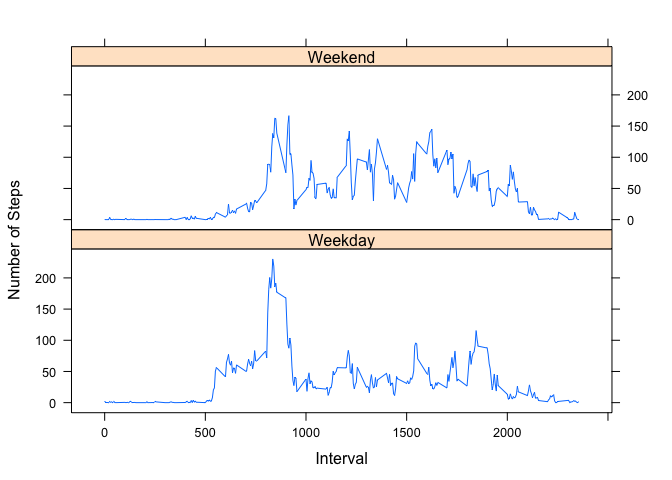

#Project 1
=================================================
##Reproducible Research

### Data is Activity Montering Data. 
####Downloaded from https://d396qusza40orc.cloudfront.net/repdata%2Fdata%2Factivity.zip
####Download data is 8-12-2014

We are doing some basic exploratory analysis.

Load CSV file, with stringsAsFactors false.


```r
# setwd("Coursera/05 - RepResearch/Data")
act <- read.csv("activity.csv", stringsAsFactors = FALSE)
```

Aggregate the data and make a histogram of the steps taken per day for an overview of the data, ignoring missing values.


```r
acts <- aggregate(steps ~ date, data = act, FUN = sum, na.rm = TRUE)
par(mfrow = c(1,1))
hist(acts$steps, xlab = "Total Number of Daily Steps"
     , main = "Daily Steps")
```

 

Lets get the mean and median number of steps a day, ignoring missing values.


```r
mean(acts$steps)
```

```
## [1] 10766
```

```r
median(acts$steps)
```

```
## [1] 10765
```

Look at the daily activity pattern, ignoring missing values. Plot these with a line plot.


```r
actt <- aggregate(steps ~ interval, data = act, FUN = mean, na.rm = TRUE)
plot(actt$interval, actt$steps, type = "l", ylab = "Average Steps Each Interval"
     ,xlab = "Interval", main = "Daily Activity Pattern in 5 Minute Intervals")
```

 

Find the start of the 5 minute interval with the largest number of steps, ignoring missing values.


```r
actm <- aggregate(steps ~ interval, data = actt, FUN = max, na.rm = TRUE)
actm[actm$steps == max(actm$steps),]
```

```
##     interval steps
## 104      835 206.2
```

Impute missing values into the NA rows, using the mean of each 5 minute interval.


```r
actsub <- subset(act, is.na(act$steps))
actrest <- act[complete.cases(act[,1]),]
actmean <- aggregate(steps ~ interval, data = act, FUN = mean, na.rm = TRUE)
actsub <- merge(actsub,actmean,by.x = "interval", by.y = "interval"
                ,stringsAsFactors = FALSE)
actsub <- actsub[,c(4,3,1)]
colnames(actsub) <- c("steps","date","interval")
actall  <- rbind(actsub,actrest)
```

Calculate mean and medium of the dataset, with imputed values.


```r
actalls <- aggregate(steps ~ date, data = actall, FUN = sum)
mean(actalls$steps)
```

```
## [1] 10766
```

```r
median(actalls$steps)
```

```
## [1] 10766
```

Create another histogram on the steps taken per day, using data with imputed values.


```r
hist(actalls$steps, xlab = "Total Number of Daily Steps"
     , main = "Daily Steps")
```

 

Using the 5 minute time interval mean to impute values has caused very little fluctuation in the data.

Break the data up into weekday and weekend, and run two line plots.


```r
actall$day <- weekdays(as.Date(actall$date))

actallwd <- actall[actall$day != "Saturday" & actall$day != "Sunday",]
actallwe <- actall[actall$day == "Saturday" | actall$day == "Sunday",]

actallwd <- aggregate(steps ~ interval, data = actallwd, FUN = mean, na.rm = TRUE)
actallwe <- aggregate(steps ~ interval, data = actallwe, FUN = mean, na.rm = TRUE)

actallwd$wewd  <- as.vector(rep("Weekday",nrow(actallwd)))
actallwe$wewd  <- as.vector(rep("Weekend",nrow(actallwe)))

actall <- rbind(actallwe,actallwd)

library(lattice)

xyplot(steps ~ interval | wewd, data=actall, type='l', layout = c(1,2),
       xlab = "Interval", ylab = "Number of Steps")
```

 

I think we can say that there is more overall weekend activity, and it occurs throughout the daytime hours, although moring hours during the weekdays has a higher peak.  
